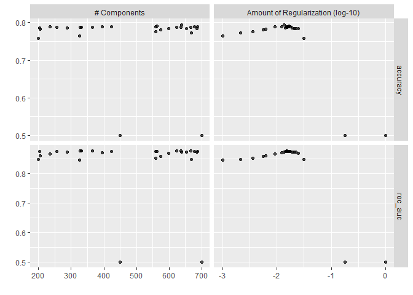
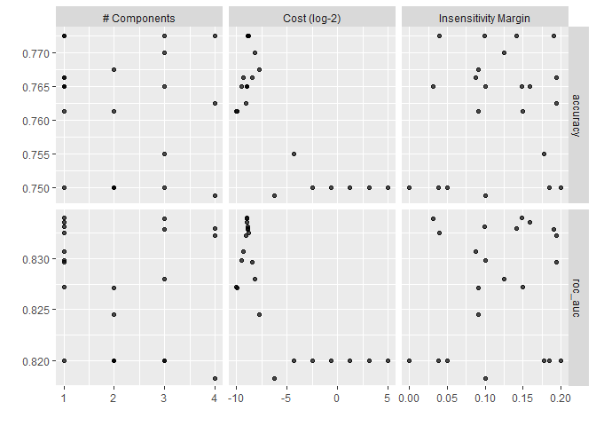
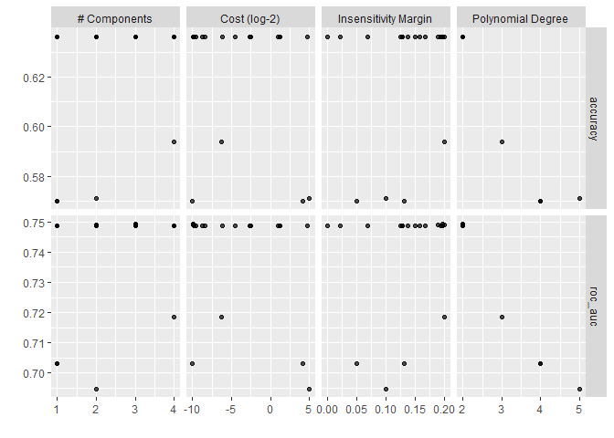
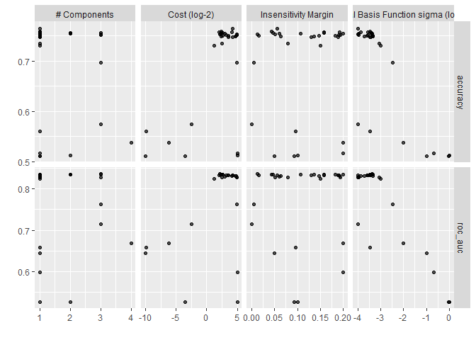
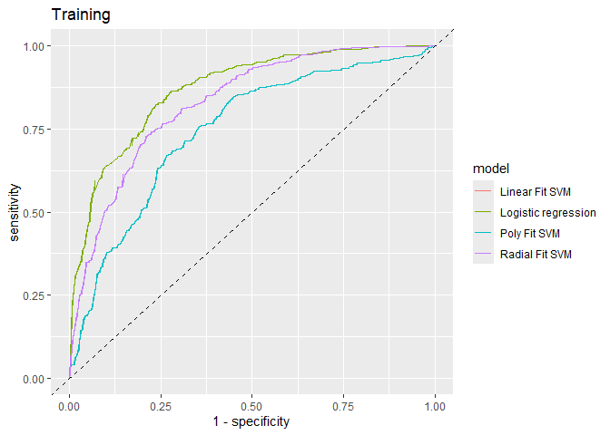

Homework9
================
Patrick Foster
2025-04-04

# Load packages

``` r
library(tidymodels)
library(tidyverse)
library(patchwork)
library(textrecipes)
library(stopwords)
```

# Text Sentiment Analysis

## Part 1

### Setup parallel processing

We start a cluster for faster calculations.

``` r
library(doParallel)
cl <- makePSOCKcluster(parallel::detectCores(logical = FALSE))
registerDoParallel(cl)
```

### 1.1 Read in the data.

Here we use read_delim.

``` r
data <- as_tibble(read_delim('https://gedeck.github.io/DS-6030/datasets/homework/sentiment_labelled_sentences/amazon_cells_labelled.txt', delim = "\t", 
                   col_names = F,
                   show_col_types = FALSE))
```

And thn rename the columns as needed.

``` r
data <- data %>% 
  rename( sentence = X1, sentiment = X2) %>% 
  mutate(sentiment = as.factor(sentiment))
```

### 1.2 Split and cross validation

Now we partition the data into a training/test split and set up the 10
fold cross validation.

``` r
data_split <- initial_split(data, prop=0.8, strata = sentiment)
train <- training(data_split)
test <- testing(data_split)

resamples <- vfold_cv(train, strata = sentiment)

cv_control <- control_resamples(save_pred=TRUE)
cv_metrics <- metric_set(roc_auc, accuracy)
```

### 1.3 Create a recipe

``` r
formula <- sentiment~sentence

rec <- recipe(formula, data = train) %>% 
  step_tokenize(sentence) %>% 
  step_tokenfilter(sentence, max_tokens = 1000) %>% 
  step_tfidf(sentence) %>% 
  step_normalize() %>% 
  step_pca(num_comp = tune())
```

## Part 2 Train Models

### 1.4 Workflow for L1 regularization

``` r
log_spec <- logistic_reg(mode="classification", penalty = tune()) %>%
    set_engine("glmnet")

log_wf <- workflow() %>% 
  add_recipe(rec) %>% 
  add_model(log_spec)
```

``` r
parameters <- extract_parameter_set_dials(log_wf)

parameters <- parameters %>% 
  update(
    num_comp = num_comp(c(200, 700)),
    penalty = penalty(c(-3,0))
  )
```

``` r
tune_results_log  <- tune_bayes(log_wf, 
                                resamples=resamples,
                                metrics = cv_metrics,
                                param_info=parameters, 
                                iter=25)
```

    ## ! No improvement for 10 iterations; returning current results.

``` r
autoplot(tune_results_log)
```



``` r
best_params_log <- select_best(tune_results_log, metric = "roc_auc")
lb <- show_best(tune_results_log, metric = "roc_auc", n=1)
metric_pos <- which(names(lb) == ".metric")
lb<- lb %>% 
  select(1:metric_pos,mean)
knitr::kable(lb,caption = "Hyperparameters for Logistic Regression",digits = 3)
```

| penalty | num_comp | .metric |  mean |
|--------:|---------:|:--------|------:|
|   0.015 |      636 | roc_auc | 0.875 |

Hyperparameters for Logistic Regression

### 1.5 Tune a linear SVM

``` r
linear_svm_spec <- svm_linear(mode="classification", 
                              cost = tune(), 
                              margin = tune()) %>%
    set_engine("kernlab")

linear_wf <- workflow() %>% 
  add_recipe(rec) %>% 
  add_model(linear_svm_spec)
```

``` r
parameters <- extract_parameter_set_dials(linear_wf)
```

``` r
tune_results_linear_svm <- tune_bayes(linear_wf, 
                                resamples=resamples,
                                metrics = cv_metrics,
                                param_info=parameters, 
                                iter=25)
```

    ## ! No improvement for 10 iterations; returning current results.

``` r
autoplot(tune_results_linear_svm)
```



``` r
best_params_linear <- select_best(tune_results_linear_svm, metric = "roc_auc")
sb <- show_best(tune_results_linear_svm, metric = "roc_auc", n=1)
metric_pos <- which(names(sb) == ".metric")
sb<- sb %>% 
  select(1:metric_pos,mean)
knitr::kable(sb,caption = "Hyperparameters for Linear SVM",digits = 3)
```

|  cost | margin | num_comp | .metric |  mean |
|------:|-------:|---------:|:--------|------:|
| 0.002 |  0.148 |        1 | roc_auc | 0.834 |

Hyperparameters for Linear SVM

### 1.6 Tune a polynomial kernel

``` r
poly_svm_spec <- svm_poly(mode="classification", 
                              cost = tune(), 
                              margin = tune(),
                              degree = tune()) %>%
    set_engine("kernlab")

poly_wf <- workflow() %>% 
  add_recipe(rec) %>% 
  add_model(poly_svm_spec)
```

``` r
parameters <- extract_parameter_set_dials(poly_wf)

parameters <- parameters %>% 
  update(
    degree = degree_int(range = c(2,5))
  )
```

``` r
tune_results_poly_svm <- tune_bayes(poly_wf, 
                                resamples=resamples,
                                metrics = cv_metrics,
                                param_info=parameters, 
                                iter=25)
```

    ## ! The Gaussian process model is being fit using 4 features but only has 5
    ##   data points to do so. This may cause errors or a poor model fit.

    ## ! No improvement for 10 iterations; returning current results.

``` r
autoplot(tune_results_poly_svm)
```



``` r
best_params_poly <- select_best(tune_results_poly_svm, metric = "roc_auc")
pb <- show_best(tune_results_poly_svm, metric = "roc_auc", n=1)
metric_pos <- which(names(pb) == ".metric")
pb<- pb %>% 
  select(1:metric_pos,mean)
knitr::kable(pb,caption = "Hyperparameters for Polynomial SVM",digits = 3)
```

|  cost | degree | margin | num_comp | .metric |  mean |
|------:|-------:|-------:|---------:|:--------|------:|
| 0.001 |      2 |  0.197 |        3 | roc_auc | 0.749 |

Hyperparameters for Polynomial SVM

### 1.7 Tune a Radial Kernel

``` r
radial_svm_spec <- svm_rbf(mode="classification", 
                              cost = tune(), 
                              margin = tune(),
                              rbf_sigma = tune()) %>%
    set_engine("kernlab")

radial_wf <- workflow() %>% 
  add_recipe(rec) %>% 
  add_model(radial_svm_spec)
```

``` r
parameters <- extract_parameter_set_dials(radial_wf)

parameters <- parameters %>% 
  update(
    rbf_sigma = rbf_sigma(range = c(-4,0),trans = log10_trans())
  )
```

``` r
tune_results_radial_svm <- tune_bayes(radial_wf, 
                                resamples=resamples,
                                metrics = cv_metrics,
                                param_info=parameters, 
                                iter=25)
```

    ## ! The Gaussian process model is being fit using 4 features but only has 5
    ##   data points to do so. This may cause errors or a poor model fit.

``` r
autoplot(tune_results_radial_svm)
```



``` r
best_params_radial <- select_best(tune_results_radial_svm, metric = "roc_auc")
rb <- show_best(tune_results_radial_svm, metric = "roc_auc", n=1)
metric_pos <- which(names(rb) == ".metric")
rb<- rb %>% 
  select(1:metric_pos,mean)
knitr::kable(rb,caption = "Hyperparameters for Radial SVM",digits = 3)
```

|  cost | rbf_sigma | margin | num_comp | .metric |  mean |
|------:|----------:|-------:|---------:|:--------|------:|
| 4.329 |         0 |  0.013 |        3 | roc_auc | 0.836 |

Hyperparameters for Radial SVM

## Part C Model Peformance

### 1.8 Compare performances

``` r
final_wf_log <- finalize_workflow(log_wf, best_params_log)
final_fit_log <- fit_resamples(final_wf_log, resamples = resamples, 
                               metrics = cv_metrics, data = train, 
                               control = cv_control)
```

``` r
fit_log_metric <- collect_metrics(final_fit_log)
```

``` r
final_wf_linear <- finalize_workflow(linear_wf, best_params_linear)
final_fit_linear <- fit_resamples(final_wf_linear, resamples = resamples, 
                               metrics = cv_metrics, data = train,
                               control = cv_control)
```

``` r
fit_linear_metric <- collect_metrics(final_fit_linear)
```

``` r
final_wf_poly <- finalize_workflow(poly_wf, best_params_poly)
final_fit_poly <- fit_resamples(final_wf_poly, resamples = resamples, 
                               metrics = cv_metrics, data = train,
                               control = cv_control)
```

``` r
fit_poly_metric <- collect_metrics(final_fit_poly)
```

``` r
final_wf_radial <- finalize_workflow(radial_wf, best_params_radial)
final_fit_radial <- fit_resamples(final_wf_radial, resamples = resamples, 
                               metrics = cv_metrics, data = train,
                               control = cv_control)
```

``` r
fit_radial_metric <- collect_metrics(final_fit_radial)
```

``` r
roc_cv_data <- function(model_cv) {
    cv_predictions <- collect_predictions(model_cv)
    cv_predictions %>%
        roc_curve(truth=sentiment, .pred_0, event_level="first")
}
roctrain <- bind_rows(
    roc_cv_data(final_fit_log) %>% mutate(model="Logistic regression"),
    roc_cv_data(final_fit_log) %>% mutate(model="Linear Fit SVM"),
    roc_cv_data(final_fit_poly) %>% mutate(model="Poly Fit SVM"),
    roc_cv_data(final_fit_radial) %>% mutate(model='Radial Fit SVM')
) %>%
ggplot(aes(x=1 - specificity, y=sensitivity, color=model)) +
    geom_line(show.legend = T)+
    geom_abline(linetype = 'dashed')+
  labs(title='Training')
```

``` r
roctrain
```



``` r
fit_log_metric <- fit_log_metric %>% mutate(Model = "Logistic Regression")
fit_linear_metric <- fit_linear_metric %>% mutate(Model = "Linear Fit SVM")
fit_poly_metric <- fit_poly_metric %>% mutate(Model = "Polynomial Fit SVM")
fit_radial_metric <-  fit_radial_metric %>% mutate(Model = "Radial Fit SVM")

test_results <- bind_rows(fit_log_metric,fit_linear_metric,
                          fit_poly_metric,fit_radial_metric) %>% 
  select(Model, .metric, mean)
 knitr::kable(test_results, caption = 
               "Comparison of Different Models on Training Data",
             digits = 3)
```

| Model               | .metric  |  mean |
|:--------------------|:---------|------:|
| Logistic Regression | accuracy | 0.787 |
| Logistic Regression | roc_auc  | 0.875 |
| Linear Fit SVM      | accuracy | 0.765 |
| Linear Fit SVM      | roc_auc  | 0.834 |
| Polynomial Fit SVM  | accuracy | 0.636 |
| Polynomial Fit SVM  | roc_auc  | 0.749 |
| Radial Fit SVM      | accuracy | 0.752 |
| Radial Fit SVM      | roc_auc  | 0.836 |

Comparison of Different Models on Training Data

In this case we surprisingly see that the best metric on Training data
is the Logistic Regression, then followed by the Radial Fit.

### 1.9 Compare Finalized Models on Test Data

``` r
final_fit_log_model <- fit(final_wf_log, data = train)
final_fit_linear_model <- fit(final_wf_linear, data = train)
```

    ##  Setting default kernel parameters

``` r
final_fit_poly_model <- fit(final_wf_poly, data = train)
final_fit_radial_model <- fit(final_wf_radial, data = train)

holdout_log <- augment(final_fit_log_model, new_data = test,)
holdout_linear <- augment(final_fit_linear_model, new_data = test)
holdout_poly <- augment(final_fit_poly_model, new_data = test)
holdout_radial <- augment(final_fit_radial_model, new_data = test)
```

``` r
bind_rows(
  cv_metrics(holdout_log, truth = sentiment, estimate = .pred_class, .pred_0)
  %>% mutate(model = "Logistic"),
  cv_metrics(holdout_linear, truth = sentiment, estimate = .pred_class, .pred_0) 
  %>% mutate(model = "Linear SVM"),
  cv_metrics(holdout_poly, truth = sentiment, estimate = .pred_class, .pred_0) 
  %>% mutate(model = "Poly SVM"),
  cv_metrics(holdout_radial, truth = sentiment, estimate = .pred_class, .pred_0)
  %>% mutate(model = "Radial SVM")
) %>%
  select(model, .metric, .estimate) %>%
  knitr::kable(caption = "Test Set Performance Across Models", digits = 3)
```

| model      | .metric  | .estimate |
|:-----------|:---------|----------:|
| Logistic   | accuracy |     0.830 |
| Logistic   | roc_auc  |     0.899 |
| Linear SVM | accuracy |     0.750 |
| Linear SVM | roc_auc  |     0.832 |
| Poly SVM   | accuracy |     0.650 |
| Poly SVM   | roc_auc  |     0.759 |
| Radial SVM | accuracy |     0.745 |
| Radial SVM | roc_auc  |     0.836 |

Test Set Performance Across Models

Here we see the similar results from the holdout, The best is Logistic,
followed by radial and Poly.

``` r
stopCluster(cl)
registerDoSEQ()
```
