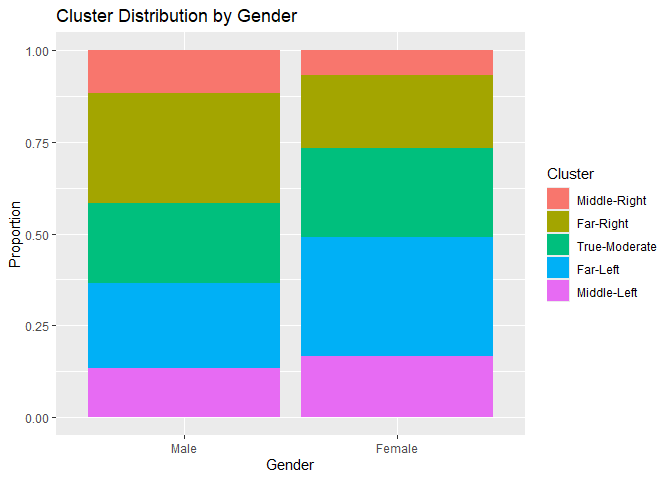
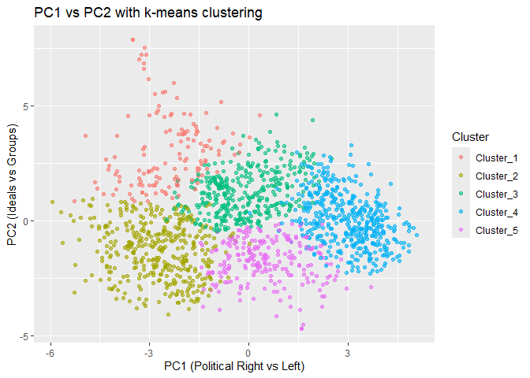
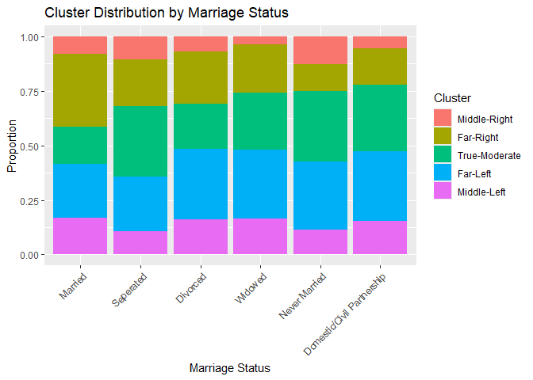
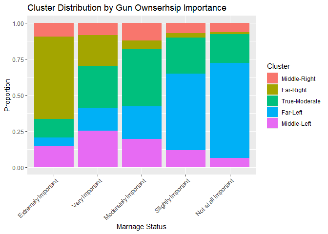

Homework10
================
Patrick Foster
2025-04-06

### Load packages

``` r
library(tidyverse)
library(tidyclust)
library(tidymodels)
library(embed)
library(ggrepel)
library(patchwork)
```

# The 2022 ANES Pilot Study

## PCA Analysis

``` r
library(doParallel)
cl <- makePSOCKcluster(parallel::detectCores(logical = FALSE))
registerDoParallel(cl)
```

## Part A. Setup

``` r
data <- read_csv('https://gedeck.github.io/DS-6030/datasets/anes_pilot_2022_csv_20221214/anes_pilot_2022_csv_20221214.csv', show_col_types = F)
```

### 1.1 Identify the feeling thermometer questions

Here we can use the select function from `dpylr` to only select the
columns we want to analyze. Here we want to remove the timing columns,
the ord columns, and the columns that contain black and white.

``` r
ft <- data %>% 
  select(caseid,starts_with('ft'),jan6therm) %>% 
  select(-contains('timing')) %>% 
  select(-contains('white'),-contains('black'))
```

### 1.2 Filter out NA

Since the NAs were recorded as negative values we can use base R, to
subset the dataframe to only include positive values and input NA values
on the negatives. Then we can use the `drop_na()` function to remove any
rows that contain NA values.

``` r
ft[ft < 0] <- NA
ft <- ft %>% 
  drop_na()
```

``` r
nrow(ft)
```

    ## [1] 1563

We now have approximately 1560 rows with 16 feeling thermometer
questions.

## Part B PCA

Now we set up the PCA for the ft data.

``` r
pca_rec <- recipe(data=ft, formula = ~.) %>%
    update_role(caseid,new_role = "id") %>% 
    step_normalize(all_numeric_predictors()) %>%
    step_pca(all_numeric_predictors())

ft_pca <- pca_rec %>%
    prep() %>%
    bake(new_data=NULL)
```

### 1.3 Create a Scree plot

``` r
explained_variance <- pca_rec %>% 
  prep() %>% 
  pluck('steps',2) %>% 
  tidy(type='variance')

explained_variance %>% 
  pivot_wider(id_cols="component", names_from="terms", values_from="value")
```

    ## # A tibble: 16 × 5
    ##    component variance `cumulative variance` `percent variance`
    ##        <int>    <dbl>                 <dbl>              <dbl>
    ##  1         1    5.97                   5.97             37.3  
    ##  2         2    3.36                   9.33             21.0  
    ##  3         3    1.34                  10.7               8.39 
    ##  4         4    0.871                 11.5               5.45 
    ##  5         5    0.707                 12.3               4.42 
    ##  6         6    0.559                 12.8               3.49 
    ##  7         7    0.526                 13.3               3.29 
    ##  8         8    0.426                 13.8               2.66 
    ##  9         9    0.419                 14.2               2.62 
    ## 10        10    0.372                 14.6               2.33 
    ## 11        11    0.321                 14.9               2.01 
    ## 12        12    0.292                 15.2               1.82 
    ## 13        13    0.281                 15.4               1.76 
    ## 14        14    0.247                 15.7               1.54 
    ## 15        15    0.182                 15.9               1.14 
    ## 16        16    0.126                 16                 0.789
    ## # ℹ 1 more variable: `cumulative percent variance` <dbl>

``` r
perc_variance <- explained_variance %>% filter(terms == "percent variance")
cum_perc_variance <- explained_variance %>% filter(terms == "cumulative percent variance")

ggplot(explained_variance, aes(x=component, y=value))+
  geom_bar(data = perc_variance, stat = "identity")+
  labs(x="Principal Component",y="Percent Variance")
```


An argument could be made for either 2 or 3 principal components, I am
going to use 2 principal components in order as there is a definite
“elbow” located there. After three principal components the amount of
variance is fairly constant and small.

### 1.4 Create A bi-plot

``` r
loadings <- pca_rec %>% 
  prep() %>% 
  pluck("steps",2) %>% 
  tidy(type = "coef") %>% 
  pivot_wider(id_cols = "terms", names_from = "component", values_from = "value")

loadings %>% 
  select("terms","PC1","PC2") %>% 
  arrange(desc(PC1))
```

    ## # A tibble: 16 × 3
    ##    terms          PC1     PC2
    ##    <chr>        <dbl>   <dbl>
    ##  1 ftbiden    0.352    0.0417
    ##  2 ftdem      0.345    0.0218
    ##  3 ftjourn    0.318   -0.0617
    ##  4 ftfem      0.308   -0.0550
    ##  5 fttrans    0.286   -0.108 
    ##  6 ftfbi      0.270   -0.0891
    ##  7 ftteach    0.264   -0.187 
    ##  8 ftwomen    0.144   -0.368 
    ##  9 fthisp     0.142   -0.381 
    ## 10 ftasian    0.111   -0.393 
    ## 11 ftmen      0.00563 -0.424 
    ## 12 ftnfem    -0.148   -0.304 
    ## 13 ftscotus  -0.168   -0.295 
    ## 14 jan6therm -0.254   -0.159 
    ## 15 ftrep     -0.266   -0.274 
    ## 16 fttrump   -0.314   -0.205

``` r
scale <-15
ggplot(ft_pca, aes(x=PC1, y=PC2))+
  geom_point(color= "darkgrey")+
  geom_segment(data=loadings,
               aes(xend=scale*PC1, yend=scale*PC2,x=0,y=0),
               arrow = arrow(length = unit(.15,"cm")))+
  geom_label_repel(data=loadings,
             aes(x=scale*PC1,y=scale*PC2,label=terms),
             size = 3, max.overlaps = 20)+
  labs(title = "PCA Biplot")
```


### 1.5 Interpret the two components.

Component 1 seems to be the traditional left-right partisan split on the
Us electorate, The ftbiden, ftdem, ftfem, are all the most positive PC1,
whereas the fttrump and ftrep are the most negative values of PC1. PC2
is harder to quantify.

``` r
loadings %>% 
  select("terms","PC1","PC2") %>% 
  arrange(desc(PC2))
```

    ## # A tibble: 16 × 3
    ##    terms          PC1     PC2
    ##    <chr>        <dbl>   <dbl>
    ##  1 ftbiden    0.352    0.0417
    ##  2 ftdem      0.345    0.0218
    ##  3 ftfem      0.308   -0.0550
    ##  4 ftjourn    0.318   -0.0617
    ##  5 ftfbi      0.270   -0.0891
    ##  6 fttrans    0.286   -0.108 
    ##  7 jan6therm -0.254   -0.159 
    ##  8 ftteach    0.264   -0.187 
    ##  9 fttrump   -0.314   -0.205 
    ## 10 ftrep     -0.266   -0.274 
    ## 11 ftscotus  -0.168   -0.295 
    ## 12 ftnfem    -0.148   -0.304 
    ## 13 ftwomen    0.144   -0.368 
    ## 14 fthisp     0.142   -0.381 
    ## 15 ftasian    0.111   -0.393 
    ## 16 ftmen      0.00563 -0.424

Looking at the values of PC2 arranged in descending order it seems that
PC2 is more of a distinguisher of group types, where we see that the
most negative values are women, hisp, asian, and men.

## Part C. Explore the dataset

### 1.6 Map respondents profile

``` r
ft_profile <- data %>% 
  select(caseid,gender,educ,marstat)
```

``` r
ft_profile <- ft_profile %>% 
  mutate(
    gender = factor(gender,levels = c(1,2),labels = c("Male","Female")),
    educ = factor(educ,levels=c(1,2,3,4,5,6),labels = c("No Hs","High School Graduate","Some College", "2-Year","4-Year", "Post Grad")),
    marstat = factor(marstat, levels = c(1,2,3,4,5,6),labels=c("Married","Seperated","Divorced","Widowed","Never Married","Domestic/Civil Partnership"))
  )
```

``` r
head(ft_profile)
```

    ## # A tibble: 6 × 4
    ##   caseid gender educ                 marstat      
    ##    <dbl> <fct>  <fct>                <fct>        
    ## 1      1 Male   2-Year               Divorced     
    ## 2      2 Female Post Grad            Divorced     
    ## 3      3 Male   4-Year               Divorced     
    ## 4      4 Male   High School Graduate Married      
    ## 5      5 Female 4-Year               Married      
    ## 6      6 Female Post Grad            Never Married

``` r
ft_pca <- ft_pca %>% 
  inner_join(ft, by = "caseid")
```

``` r
ft_profile <- ft_profile %>% 
  inner_join(ft_pca, by="caseid")

head(ft_profile)
```

    ## # A tibble: 6 × 25
    ##   caseid gender educ  marstat    PC1    PC2    PC3     PC4    PC5 fthisp ftasian
    ##    <dbl> <fct>  <fct> <fct>    <dbl>  <dbl>  <dbl>   <dbl>  <dbl>  <dbl>   <dbl>
    ## 1      1 Male   2-Ye… Divorc… -4.05   2.77   0.458 -0.335   0.861     32      38
    ## 2      2 Female Post… Divorc… -2.32  -3.13  -1.02  -1.05    0.229     74     100
    ## 3      3 Male   4-Ye… Divorc… -0.618  0.717 -1.62  -0.327  -0.301     51      55
    ## 4      5 Female 4-Ye… Married  4.56  -1.72  -0.155  0.0312 -0.177    100     100
    ## 5      6 Female Post… Never …  3.01   0.157  1.11   1.25   -0.110    100      75
    ## 6      7 Female Some… Married -0.846 -2.41  -0.847  0.910   0.516     80     100
    ## # ℹ 14 more variables: ftfbi <dbl>, ftscotus <dbl>, fttrump <dbl>,
    ## #   ftbiden <dbl>, ftdem <dbl>, ftrep <dbl>, ftteach <dbl>, ftfem <dbl>,
    ## #   ftnfem <dbl>, ftjourn <dbl>, ftmen <dbl>, ftwomen <dbl>, fttrans <dbl>,
    ## #   jan6therm <dbl>

``` r
ft_profile %>% 
  ggplot(aes(x=PC1,y=PC2))+
  geom_point(color = "darkgrey")+
  geom_density2d(aes(color=gender),linewidth=.6)+
  facet_wrap(~gender)+
  labs(title= "PC1 vs PC2 by Gender",
       x = "PC1 (Political Right vs Left)",
       y = "PC2 (Ideals vs Groups)")
```


Here we see that in general the females are skewed more to the right of
PC1, which is the political left, when compared to the Males. Also There
is a distinct pull up on PC2 for males, which we determined was towards
ideals vs groups.

``` r
ft_profile %>% 
  ggplot(aes(x=PC1,y=PC2))+
  geom_point(color = "darkgrey")+
  geom_density2d(aes(color=educ),linewidth=.6)+
  facet_wrap(~educ)+
  labs(title= "PC1 vs PC2 by Education Level",
       x = "PC1 (Political Right vs Left)",
       y = "PC2 (Ideals vs Groups)")
```


It seems that as education level increases generally the groups skew
more towards the political left.

``` r
ft_profile %>% 
  ggplot(aes(x=PC1,y=PC2))+
  geom_point(color = "darkgrey")+
  geom_density2d(aes(color=marstat),linewidth=.6)+
  facet_wrap(~marstat)+
  labs(title= "PC1 vs PC2 by Marriage Status",
       x = "PC1 (Political Right vs Left)",
       y = "PC2 (Ideals vs Groups)")
```


Interestingly the married group has two distinct peaks, one for
political left vs political right. The never married group has one peak
it’s pretty much right in the middle!

### 1.7 Gun Ownership and PCA Analysis

My hypothesis for gun ownership is that those who say that gun ownership
rights are extremely important will have a very negative value of PCA 1,
and a negative value of PCA2, so they will be on the political right and
have stronger opinions on groups. Whereas the opposite will hold true
for those who say it is not important at all.

``` r
guns <- data %>% 
  select(caseid, gunown) %>% 
  mutate(
    gunown = factor(gunown, levels=c(1,2,3,4,5),labels=c("Extremely Important","Very Important","Moderately Important","Slightly Important","Not at all Important"))
  )
```

``` r
ft_profile_gun <- ft_profile %>% 
  inner_join(guns,by="caseid")
```

``` r
ft_profile_gun %>% 
  ggplot(aes(x=PC1,y=PC2))+
  geom_point(color = "darkgrey")+
  geom_density2d(aes(color=gunown),linewidth=.6)+
  facet_wrap(~gunown)+
  labs(title= "PC1 vs PC2 by Gun Ownership Importance",
       x = "PC1 (Political Right vs Left)",
       y = "PC2 (Ideals vs Groups)")
```


Here we see that the the political left vs political right is spot on.
PCA 1 does a very good job at separating this classes. Those who
classify Gun Ownership as “Extremely Important” are much more likely to
have a lower PCA1 value when compared to those in the “Not at all
important”.

## Clustering

## Part A

### 2.1 Create a hierarchical clustering.

Using the code from class we can visualize the different clustering
methods from hierarchical clustering.

``` r
get_hier_clust_fit <- function(linkage_method) {
  formula = ~.
    hier_ft <- hier_clust(linkage_method=linkage_method) %>%
        set_engine("stats") %>%
        set_mode("partition")
    hier_model <- hier_ft %>% fit(formula, data=ft)
    hier_model
}

par(mfrow=c(3, 1), mar=c(1, 1, 1, 1))
plot(get_hier_clust_fit("complete")$fit, 
    main="Complete Linkage", xlab="", sub="", ylab="")
plot(get_hier_clust_fit("average")$fit, 
    main="Average Linkage", xlab="", sub="", ylab="")
plot(get_hier_clust_fit("single")$fit,
    main="Single Linkage", xlab="", sub="", ylab="")
```


Judging from the above graph I am going to choose the complete linkage
for the balanced clustering.

Now we can tune a model to choose the clustering depth.

``` r
formula <- (~.)

rec_ft <- recipe(formula,data=ft) %>% 
  update_role(caseid,new_role = "id") %>% 
  step_normalize(all_predictors())

hier_ft <- hier_clust(num_clusters = tune()) %>% 
  set_engine("stats") %>% 
  set_mode("partition")

hier_wf <- workflow() %>% 
  add_recipe(rec_ft) %>% 
  add_model(hier_ft)
```

``` r
registerDoSEQ()
folds <- vfold_cv(ft,v=2)
grid <- tibble(num_clusters=1:10)

result <- tune_cluster(hier_wf,resamples = folds,grid = grid,
                       metrics = cluster_metric_set(sse_within_total,silhouette_avg))
registerDoParallel(cl)
```

``` r
autoplot(result)
```


Here we see that the optimal number of clusters is 3.

### 2.2 k-means clustering

We are going to create a k-means cluster using the tidyclust package.

First we define a workflow.

``` r
set.seed(126)

formula <- (~.)

rec_ft <- recipe(formula,data=ft) %>% 
  update_role(caseid,new_role = "id") %>% 
  step_normalize(all_predictors())

kmeans_ft <- k_means(num_clusters=5) %>%
    set_engine("stats") %>%
    set_mode("partition")

kmeans_wf <- workflow() %>%
    add_recipe(rec_ft) %>%
    add_model(kmeans_ft)
```

Then we can fit the model.

``` r
kmeans_model <- fit(kmeans_wf, data = ft)
```

Now we can get the predicted cluster from the model.

``` r
ft_kmeans <- augment(kmeans_model,new_data = ft) %>% 
  select(caseid, .pred_cluster)
```

Here I join it to all the other data.

``` r
ft_kmeans <- ft_kmeans %>% 
  inner_join(ft_profile,by="caseid")
```

``` r
head(ft_kmeans,3)
```

    ## # A tibble: 3 × 26
    ##   caseid .pred_cluster gender educ    marstat    PC1    PC2    PC3    PC4    PC5
    ##    <dbl> <fct>         <fct>  <fct>   <fct>    <dbl>  <dbl>  <dbl>  <dbl>  <dbl>
    ## 1      1 Cluster_1     Male   2-Year  Divorc… -4.05   2.77   0.458 -0.335  0.861
    ## 2      2 Cluster_2     Female Post G… Divorc… -2.32  -3.13  -1.02  -1.05   0.229
    ## 3      3 Cluster_3     Male   4-Year  Divorc… -0.618  0.717 -1.62  -0.327 -0.301
    ## # ℹ 16 more variables: fthisp <dbl>, ftasian <dbl>, ftfbi <dbl>,
    ## #   ftscotus <dbl>, fttrump <dbl>, ftbiden <dbl>, ftdem <dbl>, ftrep <dbl>,
    ## #   ftteach <dbl>, ftfem <dbl>, ftnfem <dbl>, ftjourn <dbl>, ftmen <dbl>,
    ## #   ftwomen <dbl>, fttrans <dbl>, jan6therm <dbl>

Now we can plot the PC1/PC2 scatter and see the cluster groupings.

``` r
ft_kmeans %>% 
  ggplot(aes(x=PC1,y=PC2))+
  geom_point(aes(color = .pred_cluster), alpha=.6)+
    labs(title= "PC1 vs PC2 with k-means clustering",
       x = "PC1 (Political Right vs Left)",
       y = "PC2 (Ideals vs Groups)",
       color = "Cluster")
```


Here we see that the clusters are definitely separating along some line.
They have different clusters for different areas of the scatter plot.
The clusters seem to further divide the political spectrum along the
PC1/PC2 Axis. Into a Far Right, Middle Right, True Moderate, Middle
Left, and Far left.

- Cluster1 : Orange : Middle-Right  
- Cluster2 : Yellow : Far-Right  
- Cluster3 : Green : True-Moderate  
- Cluster4 : Blue : Far-Left  
- Cluster5 : Purple: Middle-Left

For further analysis we can create a new variable `Cluster` with this
factor in mind.

``` r
ft_kmeans <- ft_kmeans %>% 
  mutate(
    Cluster = factor(.pred_cluster, 
   levels=c('Cluster_1','Cluster_2','Cluster_3','Cluster_4','Cluster_5'),
   labels=c("Middle-Right","Far-Right","True-Moderate","Far-Left","Middle-Left"))
  )
```

``` r
tidy(kmeans_model)
```

    ## # A tibble: 5 × 19
    ##   fthisp ftasian  ftfbi ftscotus fttrump ftbiden  ftdem  ftrep ftteach   ftfem
    ##    <dbl>   <dbl>  <dbl>    <dbl>   <dbl>   <dbl>  <dbl>  <dbl>   <dbl>   <dbl>
    ## 1 -1.36   -1.36  -0.895  -0.551   0.0710  -0.845 -0.911 -0.222  -1.32  -0.939 
    ## 2  0.266   0.361 -0.937   0.670   1.06    -1.10  -1.07   0.923  -0.474 -0.820 
    ## 3 -0.729  -0.744  0.123  -0.0569 -0.124    0.113  0.132 -0.138  -0.200 -0.0508
    ## 4  0.553   0.490  0.578  -0.747  -0.994    1.01   0.933 -0.973   0.705  0.880 
    ## 5  0.466   0.451  0.770   0.738   0.310    0.200  0.309  0.684   0.538  0.309 
    ## # ℹ 9 more variables: ftnfem <dbl>, ftjourn <dbl>, ftmen <dbl>, ftwomen <dbl>,
    ## #   fttrans <dbl>, jan6therm <dbl>, size <int>, withinss <dbl>, cluster <fct>

In order to create the Parallel Coordinate plot we have to use the tidy
command on the kmeans_model. In order to better vizualize the class
seperations I ordered the feeling thermometers by PC1.

``` r
tidy(kmeans_model) %>%
  pivot_longer(-c(cluster,size,withinss)) %>%
  left_join(loadings %>% select(terms,PC1), by = c("name"="terms")) %>% 
  mutate(name=fct_reorder(name,PC1)) %>% 
  ggplot(aes(x = name, y = value, group = factor(cluster), color = factor(cluster))) +
  geom_point() +
  geom_line() +
  labs(
    title = "Mean Cluster Value, ordered by PC1",
    x = "Feeling Thermometer Variable",
    y = "Value at Cluster Center",
    color = "Cluster"
  ) +
  theme(axis.text.x = element_text(angle = 45, hjust = 1))
```


Here we see that the cluster do tend to help separate on the political
spectrum.

## C Explore the Dataset

### 2.3 Characterize the clusters

``` r
ft_kmeans %>% 
  ggplot(aes(x=gender, fill = Cluster))+
  geom_bar(position = "fill")+
  labs(
    title = "Cluster Distribution by Gender",
    x="Gender",
    fill = "Cluster",
    y="Proportion"
  )
```



This tends to agree with what I saw in 1.6. Females tend to be more
left-leaning than men, their is a higher proportion of Left/Middle-Left
women than men.

``` r
ft_kmeans %>% 
  ggplot(aes(x=educ, fill = Cluster))+
  geom_bar(position = "fill")+
  labs(
    title = "Cluster Distribution by Education Level",
    x="Education Level",
    fill = "Cluster",
    y="Proportion"
  )+
  theme(axis.text.x = element_text(angle=45, hjust =1))
```



This also agrees with 1.6. The Far-Left definitely increases as
education increases.

``` r
ft_kmeans %>% 
  ggplot(aes(x=marstat, fill = Cluster))+
  geom_bar(position = "fill")+
  labs(
    title = "Cluster Distribution by Marriage Status",
    x="Marriage Status",
    fill = "Cluster",
    y="Proportion"
  )+
  theme(axis.text.x = element_text(angle=45, hjust =1))
```



These clusters seem to be agreeing with what I saw in 1.6. It was harder
to make seperations based on Marriage staus, however the married couples
seem to have a fairly even split across all ideologies. The never
married seem to have fewer far-right people.

### 2.4 Gun Ownership Clustering

``` r
ft_kmeans %>% 
  left_join(guns, by="caseid") %>% 
  ggplot(aes(x=gunown, fill = Cluster))+
  geom_bar(position = "fill")+
  labs(
    title = "Cluster Distribution by Gun Ownserhsip Importance",
    x="Marriage Status",
    fill = "Cluster",
    y="Proportion"
  )+
  theme(axis.text.x = element_text(angle=45, hjust =1))
```



Here it is even more clear that the distributions support the
conclusions from 1.7. The Far-Right/Right Finds Gun Ownership to be
extremely important. Of the people who say it is “not at all important”,
the far-left are the majority by far.

``` r
stopCluster(cl)
registerDoSEQ()
```
